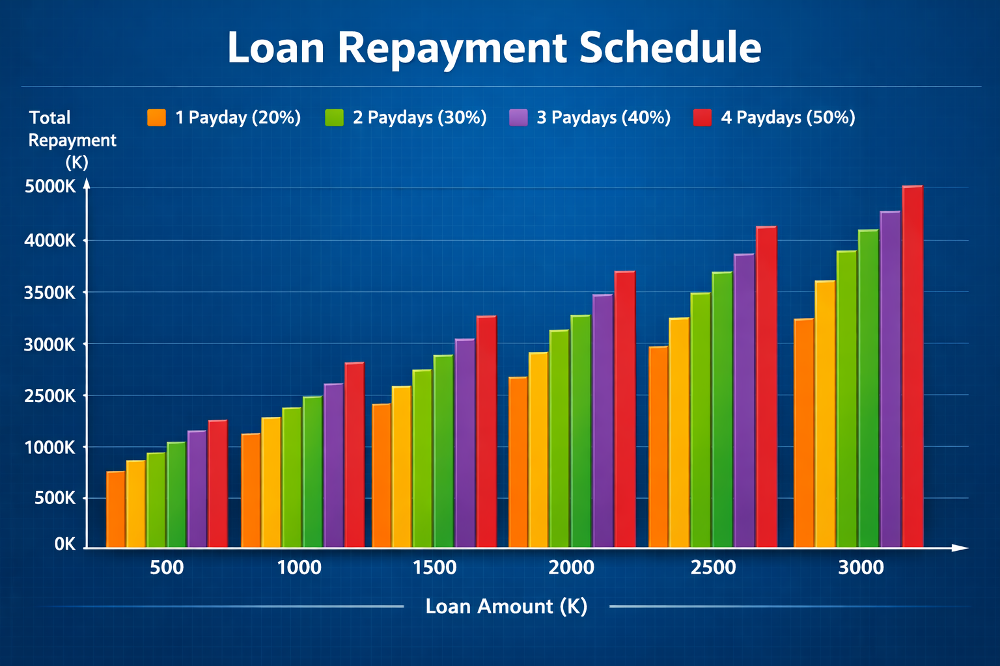

# Mole Finance Calculator
git add README.md
git commit -m "Add professional README with branding and deployment instructions"
git push origin main
Suggested README.md
markdown
# 🏦 Mole Mini Finance Loan Calculator

Helping Hand is a Caring Hand ✨

 <!-- Replace with actual logo image if available -->

---

## 📌 Project Overview
Mole Mini Finance is a community-based financial service provider in Papua New Guinea.  
This project is a **Loan Calculator** designed to help wage earners quickly estimate repayments based on loan amount and repayment period.

---

## 🚀 Features
- Salary advance loan calculations
- Flexible repayment terms (1–4 paydays)
- Interest rates: 20%–50%
- Instant calculation of total repayment and installment per payday
- Clean, mobile-friendly design

---

## 📂 Project Structure
Mole-Finance-Calculator/
├── src/                     # Frontend source code
│   ├── index.html           # Loan calculator UI
│   ├── style.css            # Styling
│   └── script.js            # Loan logic
├── docs/                    # Documentation
│   ├── BusinessProfile.docx
│   ├── BusinessPlan.docx
│   └── RepaymentSchedule.docx
├── data/                    # Backend references
│   └── Mole_Mini_Finance_Database.xlsx
├── README.md                # Project overview
└── .gitignore

Code

---

## 🛠️ Tech Stack
- **HTML5 / CSS3 / JavaScript**
- GitHub Pages for deployment
- Excel database for backend references

---

## 📊 Loan Repayment Logic
- **1 Payday** → 20% interest  
- **2 Paydays** → 30% interest  
- **3 Paydays** → 40% interest  
- **4 Paydays** → 50% interest  

Repayment = Loan Amount + (Loan Amount × Interest Rate)

---

## 🌍 Deployment
This project is live via **GitHub Pages**:

👉 [Mole Finance Loan Calculator](https://camilusdominic18-droid.github.io/mole-finance-calculator/)

---

## 🤝 Contributing
1. Fork the repo  
2. Create a feature branch (`git checkout -b feature-name`)  
3. Commit changes (`git commit -m "Add feature"`)  
4. Push to branch (`git push origin feature-name`)  
5. Open a Pull Request

---

## 📜 License
This project is licensed under the MIT License.  
Feel free to use, modify, and distribute with attribution.

---

## 🙏 Acknowledgements
- Mole Mini Finance team  
- Community of Aitape/Lumi District, Sandaun Province  
- All contributors and supporters
✅ Next Step
# 🏦 Mole Mini Finance Loan Calculator


Helping Hand is a Caring Hand ✨
# 🏦 Mole Mini Finance Loan Calculator


💡 Support Mole Mini Finance by giving this repo a ⭐ star — it helps spread the word!

---

## 📌 Project Overview
Mole Mini Finance is a community-based financial service provider in Papua New Guinea.  
This project is a **Loan Calculator** designed to help wage earners quickly estimate repayments based on loan amount and repayment period.

---

## 🚀 Features
- Salary advance loan calculations
- Flexible repayment terms (1–4 paydays)
- Interest rates: 20%–50%
- Instant calculation of total repayment and installment per payday
- Clean, mobile-friendly design

---

## 📂 Project Structure
Mole-Finance-Calculator/
├── src/                     # Frontend source code
│   ├── index.html           # Loan calculator UI
│   ├── style.css            # Styling
│   └── script.js            # Loan logic
├── docs/                    # Documentation
│   ├── BusinessProfile.docx
│   ├── BusinessPlan.docx
│   └── RepaymentSchedule.docx
├── data/                    # Backend references
│   └── Mole_Mini_Finance_Database.xlsx
├── README.md                # Project overview
└── .gitignore

---

## 🛠️ Tech Stack
- **HTML5 / CSS3 / JavaScript**
- GitHub Pages for deployment
- Excel database for backend references

---

## 📊 Loan Repayment Logic
- **1 Payday** → 20% interest  
- **2 Paydays** → 30% interest  
- **3 Paydays** → 40% interest  
- **4 Paydays** → 50% interest  

Repayment = Loan Amount + (Loan Amount × Interest Rate)

---

## 🌍 Deployment
This project is live via **GitHub Pages**:

👉 [Mole Finance Loan Calculator](https://camilusdominic18-droid.github.io/mole-finance-calculator/)

---

## 🗺️ Roadmap
Planned features and improvements:

- 📧 **EmailJS Integration**  
  Allow users to receive loan quotes directly via email.

- 📄 **PDF Quote Generation**  
  Export loan repayment schedules into downloadable PDF files.

- 📊 **Database Expansion**  
  Connect calculator with `Mole_Mini_Finance_Database.xlsx` for dynamic loan data.

- 🌐 **Improved GitHub Pages Deployment**  
  Enhance styling and responsiveness for mobile users.

- 🔒 **User Authentication (Future)**  
  Secure access for staff and clients to manage loan applications.

---

## 🤝 Contributing
1. Fork the repo  
2. Create a feature branch (`git checkout -b feature-name`)  
3. Commit changes (`git commit -m "Add feature"`)  
4. Push to branch (`git push origin feature-name`)  
5. Open a Pull Request

---

## 📜 License
This project is licensed under the MIT License.  
Feel free to use, modify, and distribute with attribution.

---

## 🙌 Credits & Community Support
This project is made possible thanks to:

- **Mole Mini Finance Team** — for vision and guidance  
- **Community of Aitape/Lumi District, Sandaun Province** — for inspiration and support  
- **Open-source contributors** — for sharing tools and knowledge  
- **You, the users** — for testing and improving the calculator  

💡 If you’d like to support Mole Mini Finance, please star ⭐ this repo or share it with others in your community.
# Contributing to Mole Mini Finance Loan Calculator

We welcome contributions to improve the Mole Mini Finance Loan Calculator!  
Here’s how you can help:

---

## 🛠️ How to Contribute
1. **Fork the repository**  
   Click the “Fork” button at the top right of this page.

2. **Clone your fork locally**  
   ```bash
   git clone https://github.com/your-username/mole-finance-calculator.git
## 📊 Loan Repayment Schedule

This project includes a full repayment schedule and visual chart to help borrowers understand repayment growth across loan sizes and paydays.



- [View Full Repayment Schedule (DOCX)](RepaymentSchedule.docx)
- [View License (MIT)](LICENSE.md)

**Chart Explanation:**  
The bars show how total repayment increases with loan size and number of paydays.  
- Orange = 1 Payday (20%)  
- Green = 2 Paydays (30%)  
- Purple = 3 Paydays (40%)  
- Red = 4 Paydays (50%)  
